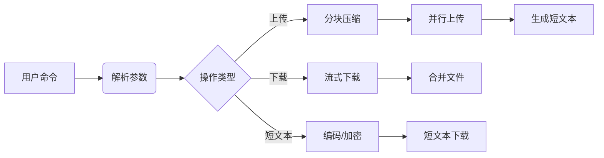

# 🐱 **喵传 MiaoSend**  

**萌萌哒文件上传/下载工具 | 支持分块传输 & 短文本分享**  

<div align="center">

```
  /\_/\  
 ( •̀ ω •́ )✧  
  / >📁< \  
 喵传 v2.0  
```
[](https://www.rust-lang.org/)

</div>

## ✨ 功能特点  

- 🐾 **萌萌哒体验**：猫咪主题进度条与提示音  
- ⚡ **闪电传输**：自动分块上传大文件（15MB/块）  
- 🔗 **短文本分享**：生成紧凑文本分享下载链接  
- 🔐 **加密传输**：支持密码加密短文本  
- 📚 **历史记忆**：记录所有上传/下载任务  
- 🔒 **安全登录**：支持账号密码认证  
- 🧩 **智能合并**：一键合并分块下载的文件  
- 🛠 **多端支持**：Windows/macOS/Linux全平台  

## 🚀 快速开始  

### 安装方式  

- 请查看actions构建

### 基本使用  

```bash
# 登录账号
miaosend login -i 你的邮箱 -p 密码

# 上传文件（自动分块）
miaosend upload -f 大文件.zip -s 保存路径

# 上传并生成加密短文本
miaosend upload -f 大文件.zip -s 保存路径 --encrypt

# 下载文件（支持进度条）
miaosend download -u 文件URL -o 保存位置

# 从短文本下载（非加密）
miaosend download-from-text -t "短文本内容" -o 保存位置

# 从加密短文本下载
miaosend download-from-text -t "加密短文本" -p 密码 -o 保存位置

# 合并分块文件
miaosend merge -o 合并后文件.zip -c 分块1.7z.001 分块2.7z.002...

# 查看历史记录
miaosend history
```

## 🧶 短文本功能  

### 什么是短文本？
短文本是喵传 v2.0 新增的功能，它将文件的分块下载链接压缩成一个紧凑的文本字符串，方便分享和传输。

### 短文本特点：
1. **高度压缩**：使用Base64编码，体积小巧
2. **加密支持**：可选密码保护，保障文件安全
3. **自包含**：包含所有必要下载信息
4. **易分享**：可通过任何文本渠道分享

### 生成示例：
```
短文本示例：
eyJ1cmxzIjpbImh0dHBzOi8vc3RhdGljLmNvZGVtYW8uY24vYXVtaWFvL1NKbEtVQmg0eGcuMDAxP2hhc2g9bHR4alZSN3p2ZUVHdnRydkNmbHdOVkFIbGJheiJdLCJvcmlnaW5hbF9maWxlX25hbWUiOiJteWZpbGUuemlwIiwiY2h1bmtfY291bnQiOjEsImVuY3J5cHRlZCI6ZmFsc2V9

加密短文本示例：
PASSWORD:xY8zPq2RtK9sWbN4|DATA:MTIzNDU2Nzg5MDEyMzQ1Njc4OTAxMjM0NTY3ODkwMTIzNDU2Nzg5MDEyMzQ1Njc4OTAxMjM0NTY3ODkwMTIzNDU2Nzg5
```

## 🧩 技术架构  



## 🐟 贡献指南  

欢迎投喂小鱼干（提交PR）！  
1. Fork本仓库  
2. 创建新分支 (`git checkout -b feature/新功能`)  
3. 提交修改 (`git commit -am '添加萌萌的新功能'`)  
4. 推送分支 (`git push origin feature/新功能`)  
5. 发起Pull Request  

## 📜 开源协议  

AGPL-3.0 License - 详见 [LICENSE](LICENSE) 文件  

---

<div align="center">
<sub>🐈 用 Rust 编写的可爱传输工具 | 喵~有问题请提交 </sub>
<a href="https://github.com/yourname/miaosend/issues">Issue</a>
</div>

---
